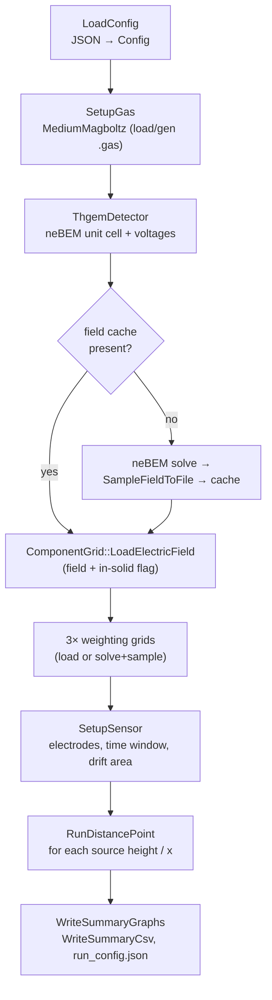
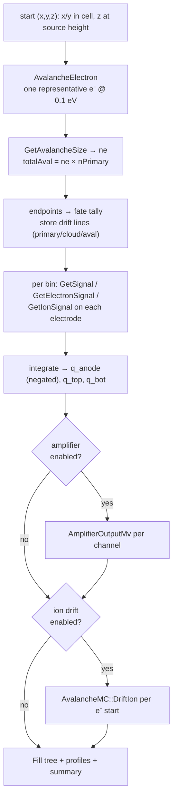

# THGEM Simulation — Developer & Physics Manual

A code-anchored walkthrough of the THGEM Garfield++ simulation, for graduate detector-physics
students who want to understand, run, or extend it. It assumes you know gas-detector basics
(ionization, drift, Townsend multiplication, induced signals) and can read C++ and Python; it spends
its length on **how this code implements the physics** and on the numerical choices that are not
obvious from the source.

The [README](../README.md) is the quick overview. This manual is the deep dive. Code is referenced by
**function / struct / section name** (e.g. `RunDistancePoint`, `SampleFieldToFile`) rather than line
number, so the references survive edits — open `src/thgem_sim.cc` and search.

## Table of contents

1. [Purpose & prerequisites](#1-purpose--prerequisites)
2. [The physics, in one page](#2-the-physics-in-one-page)
3. [The Garfield++ toolchain](#3-the-garfield-toolchain)
4. [Code map & pipeline](#4-code-map--pipeline)
5. [Field computation](#5-field-computation)
6. [Weighting fields & the three-electrode signal](#6-weighting-fields--the-three-electrode-signal)
7. [The avalanche & signal loop](#7-the-avalanche--signal-loop-rundistancepoint)
8. [Transport termination](#8-transport-termination)
9. [ROOT output schema](#9-root-output-schema)
10. [Configuration reference](#10-configuration-reference)
11. [The GUI](#11-the-gui)
12. [Numerical subtleties](#12-numerical-subtleties-consolidated)
13. [Building, running & extending](#13-building-running--extending)
14. [References](#14-references)
15. [Code-element reference](#15-code-element-reference)

---

## 1. Purpose & prerequisites

A **THGEM** (Thick Gas Electron Multiplier) is a dielectric foil (typically FR4, a few hundred µm
thick), copper-clad on both faces, pierced by a regular array of drilled holes. With a few hundred
volts across the two copper layers, the field inside each hole reaches tens of kV/cm — enough to
drive a Townsend avalanche. Primary electrons liberated in the drift gap above the foil are funnelled
into a hole, multiply, and the resulting charge is collected on an anode pad across the induction gap
below.

The binary `thgem_sim` computes, for a given geometry and set of fields:

- the **electrostatic field** of one periodic cell (the hole is not analytically solvable);
- the **Townsend gain** and the fate of the primary electrons (multiply / attach / collect);
- the **induced signals** on three electrodes (anode pad + the two copper faces), waveforms and
  integrated charge;
- optionally a **front-end amplifier** response and **ion drift** paths.

Everything is driven by one JSON config, shared with the PyQt5 GUI (`gui/app.py`). Units in the code
are Garfield's native **cm, V, ns, fC** unless a variable name says otherwise (config inputs are in
µm/mm/kV·cm⁻¹/keV and are converted on load).

**Code-element notation.** Code identifiers stay in `code`; a coloured badge marks the *kind* of
element wherever the distinction is useful — 🟦 external library API (Garfield / ROOT / Qt), 🟩 custom
class/struct, 🟧 custom function/constant, 🟨 config parameter (JSON key), 🟪 ROOT output name
(branch/object). Badges appear in the reference tables (§3–§4, §9–§10); the full
**[Code-element reference](#15-code-element-reference)** (§15) classifies every identifier used in this
manual with a one-line gloss. Running prose leaves identifiers unbadged for readability — use §15 as
the key.

---

## 2. The physics, in one page

**Primary ionization.** The code does *not* run Heed photon transport. It approximates a localized
energy deposit by placing $N = E/W$ electrons at the source point, where $E$ is `energy_keV` and $W$
is the mean energy per ion pair `w_value_eV`. For the default 5.9 keV (⁵⁵Fe) in Ar/CO₂,
$N = 5900/26 \approx 227$. One *representative* electron is transported microscopically and every
extensive quantity (avalanche size, induced charge, waveform) is multiplied by $N$ — cheap and, for a
point deposit, statistically equivalent to transporting all $N$.

**Drift & diffusion.** In the drift and induction gaps the field is nearly uniform, so electrons
drift along $-z$ toward the more positive anode with a superimposed random walk (transverse/
longitudinal diffusion). Transport parameters (drift velocity, diffusion, Townsend $\alpha$,
attachment $\eta$) come from a **Magboltz** table, tabulated vs. $|E|$.

**Multiplication.** Inside the hole the field is strong enough that $\alpha$ dominates and the number
of electrons grows as $\exp\left(\int \alpha\thinspace\mathrm{d}s\right)$. The measured gain is
$\langle n_e\rangle$ from `GetAvalancheSize`. CO₂ is an electronegative quencher, so some electrons
**attach** ($\eta$) and are lost — one reason a fraction of events never multiply.

**Induced signal (Shockley–Ramo).** A charge $q$ moving through $\mathrm{d}\vec{r}$ induces, on
electrode $i$, a current $i_i = -q\,\vec{v}\cdot\vec{E}_{w,i}$, or equivalently a charge increment
$\mathrm{d}Q_i = -q\,\mathrm{d}W_i$, where $W_i$ is the **weighting potential** of electrode $i$
(1 V on $i$, 0 V on all others, no space charge). This code integrates the potential form
$Q_i = -q\,\Delta W_i$ (see §6). The anode sees a **unipolar** collection pulse ($W$ ramps $0\to1$
across the induction gap); the copper faces see **bipolar** signals as charge transits the hole.

The observables the code produces: **gain**, **collection efficiency / fate**, and the
**per-electrode induced charge and waveforms** (raw current, electron/ion split, amplifier-shaped).

---

## 3. The Garfield++ toolchain

The simulation is assembled from Garfield++ components (all 🟦 external library API). Each does one job:

| Class | Role in this code | Why it is used |
|---|---|---|
| 🟦 `MediumMagboltz` | Gas medium; holds the transport/rate tables. Built in `SetupGas`. | Provides $\alpha$, $\eta$, drift, diffusion vs. field, and the microscopic collision-rate table. |
| 🟦 `ComponentNeBem3d` | Boundary-element field solver for **one periodic cell**. Built in `ThgemDetector`. | A drilled hole has no closed-form field and no external FEM mesh is wanted; neBEM is Garfield-native. |
| 🟦 `ComponentGrid` | Fast field on a regular mesh (trilinear interpolation). One for transport + one per weighting electrode. | Direct neBEM lookups are ~10³× too slow to drive an avalanche; sample once, interpolate forever, cache to disk. |
| 🟦 `AvalancheMicroscopic` | Microscopic electron transport (collision by collision) and the avalanche. | Needed for realistic multiplication and per-step induced signals in a strongly non-uniform field. |
| 🟦 `AvalancheMC` | Monte-Carlo, distance-stepped **ion** drift. | Bounded by construction (unlike `DriftLineRKF`); see §8. |
| 🟦 `Sensor` | Ties the transport field + the weighting electrodes together; bins the induced signal; defines the drift area. | Central hub the avalanche/ion drifters read from and write signals to. |
| 🟦 `TrackHeed` | **Not used.** | Primaries are the $N=E/W$ point deposit of §2, not a Heed cluster model. |

Not part of Garfield: a vendored `nlohmann/json` single header (`third_party/`) for config parsing,
and ROOT for all output and the GUI canvases.

---

## 4. Code map & pipeline

`src/thgem_sim.cc` (~2000 lines, C++20) is organized by `─── section ───` banners. The *Key symbols*
below are 🟩 custom classes/structs and 🟧 custom functions/constants (full list in §15):

| Section | Key symbols | What it does |
|---|---|---|
| Configuration structs | `GeometryConfig`, `FieldConfig`, `SourceConfig`, `GasConfig`, `SimulationConfig`, `AmplifierConfig`, `Config` | Typed mirror of the JSON schema (§10). |
| Utility / JSON helpers | `Mean`, `Rms`, `Sem`, `ReadDouble/Int/Bool`, `FileSafeNumber` | Statistics + defensive JSON reads. |
| CLI / Config loading | `ParseCli`, `LoadConfig` | `--config` / `--out`; JSON → `Config`. |
| Gas setup | `SetupGas` | `MediumMagboltz`: load-or-generate the `.gas` table, Penning, ion mobility, collision ceiling. |
| THGEM geometry (neBEM) | `ThgemGeom`, `ThgemDetector`, `ComputeGeom` | Builds the unit cell + solves/holds the neBEM field; derives z-planes and electrode voltages. |
| Field / weighting dump | `DumpFieldMap`, `DumpWeightingMap`, `SampleFieldToFile` | x–z slice + on-axis profile to ROOT; sample neBEM → grid text cache. |
| Cache keys | `DeriveFieldCacheName`, `DeriveWeightingCacheName` | Filenames that encode geometry (+fields for transport). |
| Sensor setup | `SetupSensor` | Electrodes, time window, drift area (with the anode-absorption inset, §8). |
| Amplifier | `ApplyOnePoleLowPass`, `ApplyBoxcarAverage`, `AmplifierOutputMv` | CIVIDEC C2-TCT transimpedance model. |
| Per-distance loop | `RunDistancePoint` | The event loop: primaries → avalanche → signals → ions → ROOT (§7). |
| Output | `WriteSummaryGraphs`, `WriteSummaryCsv`, config echo | Summary TGraphs, `summary.csv`, `run_config.json`. |
| `main` | — | Wires the stages together (below). |

**`main()` pipeline:**



The GUI (`gui/app.py`, PyQt5) has three top-level classes: `SimRunner` (a `QThread` that runs the
binary and streams its stdout to the log), `ConfigPanel` (the JSON editor, `load_from_dict`), and
`ResultsPanel` (a `QTabWidget` of result views). See §11.

---

## 5. Field computation

### The unit cell

`ThgemDetector` builds **one** THGEM cell in a `GeometrySimple` and hands it to `ComponentNeBem3d`:

- Two `SolidBox` patches — the **drift cathode** at `zDrift` and the **anode** at `zAnode` — each one
  cell wide, at their derived potentials.
- Three coaxial `SolidHole`s stacked in z — **top copper**, **dielectric**, **bottom copper** — the
  drilled hole. Copper is a `MediumConductor`, the foil a `MediumPlastic` with the material's
  $\varepsilon_r$ (`DielectricEpsR`, FR4 ≈ 4.8 / Kapton ≈ 3.5). With a rim, the two copper holes open
  to `rHole + rim` while the dielectric hole stays at `rHole`.
- `SetPeriodicityX(pitch)` / `SetPeriodicityY(pitch)` tile the cell as an infinite array.

The z-planes and voltages are derived once in `ComputeGeom` (anode is the 0 V reference; electrons
drift $-z$):

```
zDielHalf = tDiel/2                     V_anode = 0
zTopCuTop = zDielHalf + tCu             V_botCu = V_anode − E_ind · d_ind
zBotCuBot = −(zDielHalf + tCu)          V_topCu = V_botCu − ΔV_THGEM
zDrift    = zTopCuTop + d_drift         V_drift = V_topCu − E_drift · d_drift
zAnode    = zBotCuBot − d_ind
```

### The `periodic_copies` field-reversal pitfall

The drift cathode and anode are modelled as **one-cell `SolidBox` patches**, not infinite planes.
Under the periodic solve neBEM sums a **finite** number of mirror copies (`periodic_copies`, using
$2n{+}1$ tiles). Too few copies and the truncated sum of these finite patches leaves the on-axis
drift-gap field **reversed** in a pocket mid-gap — electrons entering the pocket are pushed *away*
from the hole and trapped, so a run appears to hang, gives gain ≈ 1, or exhausts memory.

The fix is simply **enough copies**: ≥7 for the 800 µm-pitch / 3 mm-gap geometry, ≥9 for the larger
5 mm-gap / 1000 µm default. A larger drift-gap-to-pitch ratio needs more. Do **not** try to replace
the anode patch with `ComponentNeBem3d::AddPlaneZ`: under a periodic solve it does not enforce the
plane boundary condition (measured: the "0 V" anode plane read −543 V).

### Sampling to a grid + the in-solid flag

Direct neBEM evaluation is far too slow for millions of avalanche steps, so `SampleFieldToFile`
evaluates the solved field on the transport mesh once and writes a text file: per node
`x y z  Ex Ey Ez  V  flag`. `ComponentGrid::LoadElectricField(..., withPotential=true, withFlag=true)`
reads it back and interpolates trilinearly during transport.

The **`flag`** is `det.InGas(x,y,z)` (1 = gas, 0 = inside copper/dielectric). Without it a
`ComponentGrid` carries no material information and electrons would drift straight through metal; with
it, `ComponentGrid::GetMedium` returns `null` inside a solid and the electron is absorbed on contact —
this is how the copper and the foil stop charge. (Electrode *collection* at the anode/cathode is a
separate mechanism, §8.)

The transport grid spans **one cell** in x/y (`kGridHalfSpanFactor = 0.5`, so half-width = pitch/2)
and `zAnode → zDrift` in z, with `EnableMirrorPeriodicityX/Y`: an electron that diffuses past a cell
edge re-enters the mirrored neighbour, exactly as the field is periodic. Charge is only ever removed
in z (at an electrode) or on a solid.

### Caching

Solving neBEM and sampling takes minutes; both are cached to `field_cache/` as text keyed by content:

- `DeriveFieldCacheName` — geometry **and** fields (`…_dV…_Ed…_Ei…`), because the transport field
  scales with the applied voltages.
- `DeriveWeightingCacheName` — geometry **only** (no voltages): a Shockley–Ramo weighting field
  depends on electrode *shapes*, not on the bias, so a whole ΔV scan reuses one weighting solve.

Both carry a `_v2` format tag and append `_rim<µm>` only when a rim is set (so straight-hole caches
stay valid). A cache hit means neBEM is never even initialized; a miss triggers one solve that
produces the transport field and all three weighting fields together. The caches for the two bundled
configs are committed (see the README), so a fresh clone runs with no solve.

---

## 6. Weighting fields & the three-electrode signal

Three electrodes are read out — `anode`, `thgem_top`, `thgem_bottom` (the drift cathode is not).
Each `Solid` is given a `SetLabel(...)`, so neBEM can solve that electrode's **true Shockley–Ramo
weighting field**: 1 V on the labelled electrode, 0 V on all others, no space charge. `DumpWeightingMap`
writes each electrode's `W` map (and $|E_w|$) to the ROOT `field/` directory; `SampleFieldToFile`
samples each onto its **own** `ComponentGrid` (one grid instance holds exactly one weighting field, so
three electrodes → three grids), added to the `Sensor` as three electrodes in `SetupSensor`.

**Why the weighting *potential*, not the weighting field.** The induced charge can be accumulated two
ways: from the field, $\mathrm{d}Q = -q\,\vec E_w\cdot\mathrm{d}\vec r$, or from the potential,
$\mathrm{d}Q = -q\,\mathrm{d}W = -q\,[W(\vec r_1) - W(\vec r_0)]$. On a **coarse sampled grid** the
interpolated $\vec E_w$ is noisy (it is a numerical gradient), whereas $W$ itself is smooth, so the
potential form gives accurate waveforms *and* integrals. Both `AvalancheMicroscopic` and `AvalancheMC`
default to it; the code makes it explicit with `aval.UseWeightingPotential(true)` (and the same on the
ion drifter). The "all electrodes" overlay in the Weighting Field tab shows each $W(z)$ peaking at its
own electrode — the direct check that the three channels are not swapped.

Physically: `anode` $W$ ramps $0\to1$ across the induction gap → a **unipolar** collection pulse;
`thgem_top`/`thgem_bottom` peak at their copper face → **bipolar** signals as charge transits the hole
(net $\Delta W\approx0$).

---

## 7. The avalanche & signal loop (`RunDistancePoint`)

Called once per (source height, x-position). It owns the per-event `TTree` (`t_signals`), the summary
histograms/profiles, and the event loop.



**Primaries.** `nPrimary = round(energy_keV·1000 / w_value_eV)` (≥1). The start `(x,y)` is a fixed
`x` (with `y=0`, an on-axis deterministic scan) or uniform over the cell; `z` is the source height in
the drift gap. One electron is launched at ~thermal energy (0.1 eV).

**Avalanche & fate.** `GetAvalancheSize` gives `ne`; `totalAvalElectrons = ne · nPrimary`. Endpoint 0
is the primary; its Garfield status × end-zone is tallied into `primaryFate`:
`DriftStatusToString(status) + " @ " + classifyEndZone(x,y,z)`. Zones: `in-gap` (above the plate),
`below-plate` (through the hole, toward the anode), `in-hole` vs. `in-plate` (inside vs. beside the
hole at plate z). A healthy default run reads e.g.

```
[fate] multiplied 27/30 events; primary endpoint: {attached @ in-hole: 5} {left drift area @ below-plate: 25}
```

i.e. 25/30 primaries multiply and are **collected at the anode** (`left drift area @ below-plate`) and
5 **attach** in the hole (CO₂). A single-event run is statistical and may show no avalanche — expected
physics, not a bug.

**Drift lines** (only with `store_drift_lines`) are stored for the 3D view as concatenated points with
a per-track length list: the primary (`primary_x/y/z`), the avalanche birth-point cloud
(`cloud_*`, capped `kMaxDispCloudPts`), and a strided, capped sample of secondary-electron transport
lines (`aval_*` + `aval_npts`, ≤ `kMaxDispElectronPaths`, ≤64 points/track).

**Signals.** For each electrode and bin, `sensor.GetSignal / GetElectronSignal / GetIonSignal` return
the induced current [fC/ns]; each is scaled by `nPrimary` into the tree branches and `TProfile`s. The
per-event integrated charge is `q = Σ i · Δt · nPrimary`; the anode integral is **negated**
(`qAnode = −rawAnode·…`) so collected charge is conventionally positive, while the copper channels are
kept as-is (their net is ~0).

**Amplifier** (if enabled). `AmplifierOutputMv` shapes each channel's current [fC/ns ≡ µA] into [mV]:
linear gain $10^{g_{dB}/20}$, an intrinsic upper-bandwidth one-pole low-pass
($\tau = 1/(2\pi f_\text{high}) $), the $g\cdot R_\text{in}$ current→voltage scale, and an optional
boxcar output aperture. A conductive pad has no input-capacitor current sink, so — unlike a resistive
readout — there is no extra input low-pass. Results go to the `*_amp` / `*_amp_int` branches.

**Ions** (if enabled). Each avalanche electron's start point back-drifts an ion with
`AvalancheMC::DriftIon`; the first `kMaxDispIonPaths` paths are stored (`ion_*`). Ions drift *up*,
away from the anode where $W\approx0$, so they add ~nothing to the anode signal — ion drift is off by
default and mainly for the 3D ion-path view / backflow studies.

---

## 8. Transport termination

Three independent conditions stop a charge; without them a run can hang or exhaust memory, because a
drifter is not otherwise bounded from outside.

1. **Electrode absorption — the primary mechanism.** `SetupSensor` sets the drift area
   `SetArea(-xy,-xy, zAnode+zMargin, xy,xy, zDrift-zMargin)` with
   `zMargin = (zDrift − zAnode)/(gridNz − 1)` — **one transport-grid cell**. `AvalancheMicroscopic`
   stops a charge when a step lands outside the area (`StatusLeftDriftArea`), and `Sensor::IsInArea`
   is a plain bounding-box test. Insetting `zmin` a cell makes the anode absorb on contact.

   *Why the inset is necessary.* With `zmin` exactly at `zAnode`, the trilinear field in the final
   grid cell is too weak to push an electron across the boundary, so it hovered ~one cell (~17 µm)
   above the anode and diffused **sideways along it for the whole time window** — the "anode-slide"
   artifact (spurious straight induction-gap lines in the 3D view, tracks wandering under neighbouring
   holes, `StatusOutsideTimeWindow` fates, wasted runtime). The signal is preserved because a hovering
   electron already induced ~nothing in that last cell.

2. **Electron time window.** `AvalancheMicroscopic::SetTimeWindow(0, time_window_ns)` bounds transport
   *in time* — the backstop for a charge that stalls at a field feature. Note
   `Sensor::SetTimeWindow` only **bins** the induced signal; it does **not** stop transport.

3. **Ion bounding.** Ion drift uses **`AvalancheMC`** (distance-stepped), *not* `DriftLineRKF`. RKF has
   no step/time bound, so a single ion looping near a field stagnation point runs forever with
   unbounded path storage (the historical hang/OOM). `AvalancheMC` steps by a fixed distance
   (`ion_max_step_um`, bounding a normal ion by geometry) and honours `ion_time_window_ns` (default
   1 ms) as the backstop for a trapped ion.

---

## 9. ROOT output schema

Each run writes `thgem_sim.root`, `summary.csv`, and a resolved `run_config.json` into a timestamped
subfolder of `--out`. Every ROOT object named below is a 🟪 ROOT output name (full list in §15).

**`field/` (once per run)** — the neBEM maps for the E-Field / Weighting tabs:

| Object | Contents |
|---|---|
| `h_field_mag`, `h_potential`, `h_field_ez`, `h_field_ex` | x–z slice (y=0) of $|E|$, $V$, $E_z$, $E_x$ (`kMapNx × kMapNz`). |
| `g_axis_field`, `g_axis_potential` | on-hole-axis profiles. |
| `h_wpot_<id>`, `h_wfield_mag_<id>`, `g_axis_wpot_<id>` | weighting potential / $|E_w|$ / on-axis $W(z)$ for `id ∈ {anode, thgem_top, thgem_bottom}`. |

**`summary/`** — TGraphs vs. source distance: `g_anode_charge`, `g_thgem_top_charge`,
`g_avalanche_size`, `g_charge_ratio`.

**`dist_<h>_x<x>/` (one per source point)** — histograms `h_anode_charge`, `h_thgem_top_charge`,
`h_thgem_bottom_charge`, `h_ratio_charge`, `h_n_primary_electrons`, `h_avalanche_size`; `TProfile`
mean waveforms `p_anode_signal`, `p_thgem_top_signal`, `p_thgem_bottom_signal`, `p_anode_electron`,
`p_anode_ion`, `p_*_amp`, `p_*_amp_int`; and the per-event tree **`t_signals`**:

| Branch group | Branches | Meaning |
|---|---|---|
| Scalars | `event`, `anode_charge_fC`, `thgem_top_charge_fC`, `thgem_bottom_charge_fC` | per-event integrated charge |
| Waveforms | `anode`, `thgem_top`, `thgem_bottom` | induced current per bin [fC/ns], ×`nPrimary` |
| e/i split | `anode_e`,`anode_i`, `thgem_top_e/_i`, `thgem_bottom_e/_i` | electron- vs. ion-induced components |
| Amplifier | `anode_amp`,`thgem_top_amp`,`thgem_bottom_amp` (+ `_int`) | shaped output [mV] and its integral |
| Geometry | `primary_x/y/z`, `cloud_x/y/z`, `aval_x/y/z`+`aval_npts`, `ion_x/y/z`+`ion_npts` | 3D drift lines (concatenated points + per-track lengths) |

The tree uses `SetBasketSize("*", 24 MB)` so each branch stays in one basket — `uproot` (used by the
GUI) mis-parses the multi-basket layout ROOT would otherwise produce for the large `aval_*` branches.

`summary.csv` has one row per source point: `source_distance_mm, x_position_cm, n_events,
n_interacted, interaction_fraction, mean/rms/sem_{anode,thgem_top,thgem_bottom}_charge_fC,
mean/rms/sem_charge_ratio, mean_primary_electrons, mean_avalanche_size`.

---

## 10. Configuration reference

Every key below is a 🟨 config parameter (JSON key). One JSON file, mirrored by the `Config` structs
(§4). Config units are converted to Garfield units on
load.

**`geometry`** — `hole_diameter_um`, `hole_pitch_um` (square array), `plate_thickness_um` (dielectric),
`copper_thickness_um` (per face), `rim_um` (copper etched back from the hole edge; 0 = straight hole),
`drift_gap_mm`, `induction_gap_mm`, `dielectric_material` (`fr4`/`kapton`). neBEM/mesh controls:
`target_element_size_um`, `min_elements`, `max_elements`, `hole_sectors` (polygon sides approximating
the circle: 2=square, 3=octagon…), `periodic_copies` (§5 — must be large enough), `grid_nx`, `grid_nz`
(transport-grid nodes; also sets the collection-cell size via `zMargin`, §8).

**`fields`** — `e_drift_kvcm`, `delta_v_thgem_V` (top→bottom copper), `e_induction_kvcm`. These become
the four electrode potentials by the §5 formulae (anode = 0 V reference).

**`source`** — `energy_keV` (→ $N=E/W$ primaries), `source_distances_mm` (heights above the top
copper; `null` = random over the drift gap per event), `x_positions_cm` (`null` = random over the
cell; a fixed `x` pins `y=0`, so `x=0` is the hole axis).

**`gas`** — `gas1`/`gas1_fraction_pct`/`gas2`, `ion_species`, `temperature_K`, `pressure_Torr`,
`enable_penning`, `n_magboltz_collisions`, `w_value_eV`, `max_electron_energy_eV` (Magboltz table
EFINAL — keys the `.gas` filename), `transport_max_energy_eV` (collision-rate ceiling; keep near the
few-eV energies electrons actually reach, since every step is sampled against the *max* rate),
`n_field_points`, `e_field_min_vcm`, `e_field_max_vcm`.

**`simulation`** — `n_events`, `max_avalanche_size` (hard cap), `time_window_ns`, `time_step_ns`
(signal bin), `enable_ion_drift` (default off), `store_drift_lines` (needed for the curved 3D lines),
`ion_max_step_um`, `ion_time_window_ns`, `max_ions_drifted` (cap per event), `random_seed` (0 =
time-seeded).

**`amplifier`** — `enable`, `gain_db`, `input_impedance_ohm`, `bandwidth_high_hz` (upper −3 dB →
low-pass $\tau$), `output_sample_ns` (boxcar aperture). CIVIDEC C2-TCT datasheet defaults.

---

## 11. The GUI

`gui/app.py` runs the same binary and visualizes its output. Three classes:

- **`SimRunner(QThread)`** — launches `thgem_sim` with the current config, streams stdout to the Log
  tab in real time, and signals completion.
- **`ConfigPanel(QScrollArea)`** — every config key as a widget; `load_from_dict` round-trips a JSON,
  and it shows the *derived* electrode voltages so a mistuned bias is obvious before running.
- **`ResultsPanel(QTabWidget)`** — the result views. Loaders open the ROOT file with `uproot`:

| Tab | Loader | Shows |
|---|---|---|
| Log | — | live binary stdout (incl. the fate line) |
| Summary | — | `summary.csv` table |
| Plots | — | charge / gain vs. distance (`summary/` graphs) |
| Waveforms | `load_waveform_data` | `anode`/`thgem_top`/`thgem_bottom` waveforms, raw or amplifier mode |
| Integrals | `load_waveform_data` | running charge integrals, 3 pads |
| 3D Tracks | `load_track_data` | geometry + primary/avalanche/ion drift lines (ROOT `TCanvas`) |
| E-Field | `load_thgem_field` | $|E|$/$V$/$E_z$/$E_x$ map + axis profile, tiled over N holes |
| Weighting Field | `load_thgem_wfield` | per-electrode $W$ / $|E_w|$, plus the "all electrodes" $W(z)$ overlay |
| Magboltz | — | gas transport parameters |

The E-Field / Weighting tabs tile the one simulated periodic cell across x (the **Holes** spinbox) —
an exact repeat, not an interpolation. The 3D view's curved lines require `store_drift_lines`.

---

## 12. Numerical subtleties (consolidated)

The non-obvious facts, in one place (each is expanded above):

- **`periodic_copies` must be large enough** (≥7 / ≥9) or the truncated periodic sum reverses the
  drift-gap field and traps charge. §5.
- **`ComponentNeBem3d::AddPlaneZ` does not work** as an infinite electrode under a periodic solve —
  use `SolidBox` patches + enough copies. §5.
- **Signals use the weighting *potential*** ($Q=q\,\Delta W$), not the noisy interpolated weighting
  field. §6.
- **Anode absorption = inset the drift-area z-bounds by one grid cell** (`SetupSensor`), else electrons
  hover and slide along the anode. §8.
- **Ions use `AvalancheMC`, not `DriftLineRKF`** (the latter is unbounded → hang/OOM). §8.
- **In-solid flag** absorbs charge inside copper/dielectric; without it charge drifts through metal. §5.
- **Caches** key transport on geometry+fields, weighting on geometry only. §5.
- **CTest / runs must start from the project root** so the committed `gas/` table and `field_cache/`
  are found; otherwise the multi-hour Magboltz table is regenerated under `build/`.
- **`transport_max_energy_eV`** should sit near the few-eV energies electrons actually reach — every
  microscopic step is sampled against the *maximum* collision rate over the whole table. §10.

These are also recorded in the project's agent memory as hard-won gotchas.

---

## 13. Building, running & extending

**Build** (ROOT's `FindVdt` needs help; paths passed explicitly):

```bash
cmake -S . -B build -DCMAKE_BUILD_TYPE=Release \
  -DVDT_INCLUDE_DIR=/path/to/miniforge3/include \
  -DVDT_LIBRARY=/path/to/miniforge3/lib/libvdt.dylib \
  -DCMAKE_PREFIX_PATH="/path/to/Garfield++/local/garfield;/path/to/miniforge3"
cmake --build build -j4
```

**Run** (ion mobility + Heed DB found via the environment):

```bash
export GARFIELD_INSTALL=/path/to/Garfield++/local/garfield
export HEED_DATABASE=$GARFIELD_INSTALL/share/Heed/database
./build/thgem_sim --config config/default_thgem.json --out results
python3 gui/app.py            # or drive the binary from the GUI
```

`ctest --test-dir build` runs the `smoke_thgem_sim` config (coarse mesh, committed caches) from the
project root.

**Extending:**

- *Add a config knob* — add the field to the relevant `…Config` struct with a default, read it in
  `LoadConfig` (via `ReadDouble/Int/Bool`), echo it in the `run_config.json` writer, and (for the GUI)
  add a widget + `load_from_dict` line. If it changes the field, add it to `DeriveFieldCacheName`
  and/or `DeriveWeightingCacheName` so stale caches are not reused, and bump the `_v2` tag if the file
  *format* changes.
- *Add a fourth readout electrode* — give its `Solid` a `SetLabel`, add the id to the readout list,
  allocate a fourth weighting `ComponentGrid`, `AddElectrode` it in `SetupSensor`, and add the branch
  set (`<id>`, `<id>_e/_i`, `<id>_amp/_amp_int`) plus the `DumpWeightingMap` call.
- *Change the gas* — edit the `gas` section; a new mixture/field grid generates a fresh Magboltz table
  (slow, one-time) keyed by the `.gas` filename.

---

## 14. References

**Software**

- **Garfield++** — H. Schindler and R. Veenhof, *Garfield++ — simulation of ionisation-based tracking
  detectors*, <https://garfieldpp.web.cern.ch/> (no single journal paper; cite the project and its
  User Guide). The framework providing `MediumMagboltz`, `ComponentNeBem3d`, `ComponentGrid`,
  `AvalancheMicroscopic`, `AvalancheMC`, and `Sensor`.
- **Magboltz** — S. F. Biagi, *Monte Carlo simulation of electron drift and diffusion in counting
  gases under the influence of electric and magnetic fields*, Nucl. Instrum. Meth. A **421** (1999)
  234–240, [doi:10.1016/S0168-9002(98)01233-9](https://doi.org/10.1016/S0168-9002(98)01233-9). Source
  of the gas transport/rate tables (`.gas`).
- **neBEM** — N. Majumdar and S. Mukhopadhyay, *Simulation of three-dimensional electrostatic field
  configuration in wire chambers: A novel approach*, Nucl. Instrum. Meth. A **566** (2006) 489–494,
  [doi:10.1016/j.nima.2006.06.035](https://doi.org/10.1016/j.nima.2006.06.035)
  ([arXiv:physics/0604030](https://arxiv.org/abs/physics/0604030); project
  <https://nebem.web.cern.ch/>). The boundary-element field solver behind `ComponentNeBem3d`.

**Detector physics**

- **GEM** — F. Sauli, *GEM: A new concept for electron amplification in gas detectors*, Nucl. Instrum.
  Meth. A **386** (1997) 531–534,
  [doi:10.1016/S0168-9002(96)01172-2](https://doi.org/10.1016/S0168-9002(96)01172-2). The
  amplification concept a THGEM thickens.
- **THGEM** — A. Breskin *et al.*, *A concise review on THGEM detectors*, Nucl. Instrum. Meth. A
  **598** (2009) 107–111, [doi:10.1016/j.nima.2008.08.062](https://doi.org/10.1016/j.nima.2008.08.062)
  ([arXiv:0807.2026](https://arxiv.org/abs/0807.2026)). The operating regime this code models.
- **Shockley–Ramo theorem** — W. Shockley, *Currents to Conductors Induced by a Moving Point Charge*,
  J. Appl. Phys. **9** (1938) 635, [doi:10.1063/1.1710367](https://doi.org/10.1063/1.1710367); and
  S. Ramo, *Currents Induced by Electron Motion*, Proc. IRE **27** (1939) 584–585,
  [doi:10.1109/JRPROC.1939.228757](https://doi.org/10.1109/JRPROC.1939.228757). The induced-signal
  theorem the code integrates via the weighting potential (§6).

**Hardware**

- **CIVIDEC C2-TCT** — CIVIDEC Instrumentation, *C2-TCT broadband transimpedance amplifier*
  (10 kHz – 2 GHz, 40 dB), <https://cividec.at/electronics-C2-TCT.html>. The front-end model in
  `AmplifierOutputMv`.

---

## 15. Code-element reference

Every code identifier used in this manual, classified. Badge key: 🟦 external library API
(Garfield / ROOT / Qt) · 🟩 custom class/struct · 🟧 custom function/constant · 🟨 config parameter
(JSON key) · 🟪 ROOT output name. Custom elements live in `src/thgem_sim.cc` unless marked *(GUI)*
(`gui/app.py`).

### 🟦 External library API — types

| Symbol | Role |
|---|---|
| `MediumMagboltz` | Gas medium; holds the transport/rate tables |
| `MediumConductor` | Copper (conductor) medium |
| `MediumPlastic` | FR4 / Kapton dielectric medium |
| `ComponentNeBem3d` | Boundary-element field solver for one periodic cell |
| `ComponentGrid` | Sampled field on a regular mesh; fast interpolation |
| `GeometrySimple` | Container holding the solids handed to neBEM |
| `SolidBox` | Box solid — drift-cathode and anode patches |
| `SolidHole` | Drilled-hole solid — the two copper layers + dielectric |
| `Solid` | Base class of the geometry primitives |
| `Sensor` | Field + electrode hub; bins signals; defines the drift area |
| `AvalancheMicroscopic` | Microscopic electron transport and the avalanche |
| `AvalancheMC` | Monte-Carlo, distance-stepped ion drift |
| `TrackHeed` | Heed primary-ionisation model — **not used** (§3) |
| `DriftLineRKF` | RKF drift-line integrator — rejected for ions (§8) |
| `TTree` | ROOT per-event tree |
| `TProfile` | ROOT mean-vs-time profile histogram |
| `TCanvas` | ROOT drawing canvas (GUI views) |
| `QThread` | Qt worker thread — base of `SimRunner` *(GUI)* |
| `QTabWidget` | Qt tabbed container — base of `ResultsPanel` *(GUI)* |
| `QScrollArea` | Qt scroll container — base of `ConfigPanel` *(GUI)* |

### 🟦 External library API — methods & status codes

| Symbol | Role |
|---|---|
| `AvalancheElectron` | Transport one electron and its avalanche |
| `GetAvalancheSize` | Electron / ion count of the avalanche |
| `GetSignal` · `GetElectronSignal` · `GetIonSignal` | Induced current per time bin (total / e⁻ / ion) |
| `DriftIon` | Drift one ion (`AvalancheMC`) |
| `SetArea` · `IsInArea` | Define / test the drift bounding box (§8) |
| `SetTimeWindow` | Transport bound (avalanche) or signal binning (sensor) |
| `UseWeightingPotential` | Integrate the signal from *W*, not **E**_w (§6) |
| `LoadElectricField` | Load a sampled grid (+ potential, + in-solid flag) |
| `AddElectrode` | Register a weighting electrode on the sensor |
| `SetLabel` | Label a solid so neBEM solves its weighting field |
| `SetPeriodicityX` · `SetPeriodicityY` | Tile the cell in the neBEM solve |
| `EnableMirrorPeriodicityX` · `EnableMirrorPeriodicityY` | Mirror-tile the sampled grid |
| `GetMedium` | Medium lookup — `null` inside a solid ⇒ absorbed (§5) |
| `SetMesh` | Define a `ComponentGrid` mesh |
| `EnableAvalancheSizeLimit` | Cap the avalanche size |
| `EnableDriftLines` | Store the microscopic drift lines |
| `SetBasketSize` | One-basket branches, for uproot compatibility |
| `AddPlaneZ` | neBEM infinite plane — does **not** hold here (§5) |
| `StatusLeftDriftArea` | Charge collected: it left the drift area (§8) |
| `StatusOutsideTimeWindow` | Charge still in flight when the window closed |
| `StatusAttached` | Electron attached (e.g. to CO₂) |

### 🟩 Custom classes / structs

| Symbol | Role |
|---|---|
| `GeometryConfig` | Geometry + mesh config block |
| `FieldConfig` | Drift / ΔV / induction field config block |
| `SourceConfig` | Primary-source energy and positions |
| `GasConfig` | Gas mixture + Magboltz-table settings |
| `SimulationConfig` | Event count, time windows, ion drift |
| `AmplifierConfig` | Front-end amplifier settings |
| `Config` | Top-level struct aggregating the six blocks |
| `CliOptions` | Parsed `--config` / `--out` command line |
| `ThgemGeom` | Derived geometry: z-planes, radii, electrode voltages |
| `ThgemDetector` | Builds the neBEM cell; owns the field solver |
| `SimRunner` | Runs the binary in a thread, streams stdout *(GUI)* |
| `ConfigPanel` | Config editor + derived-voltage readout *(GUI)* |
| `ResultsPanel` | The tabbed result views *(GUI)* |
| `MainWindow` | Top-level window *(GUI)* |

### 🟧 Custom functions / constants

| Symbol | Role |
|---|---|
| `main` | Wires the whole pipeline (§4) |
| `ParseCli` | Parse the command line into `CliOptions` |
| `LoadConfig` | Parse the JSON config into `Config` |
| `ReadDouble` · `ReadInt` · `ReadBool` | Defensive, defaulted JSON reads |
| `DielectricEpsR` | Material name → relative permittivity |
| `ComputeGeom` | `GeometryConfig` → `ThgemGeom` (z-planes, voltages) |
| `SetupGas` | Build the `MediumMagboltz`; load or generate the table |
| `InGas` | Is a point in gas (vs. inside a solid)? |
| `SampleFieldToFile` | Sample neBEM onto the grid → text cache (+ flag) |
| `DeriveFieldCacheName` | Transport-field cache filename key (geometry + fields) |
| `DeriveWeightingCacheName` | Weighting cache filename key (geometry only) |
| `DumpFieldMap` | Write the E-field x–z slice + on-axis profile to ROOT |
| `DumpWeightingMap` | Write one electrode's weighting map to ROOT |
| `SetupSensor` | Electrodes, time window, drift-area z-inset (§8) |
| `ApplyOnePoleLowPass` · `ApplyBoxcarAverage` | Amplifier filter primitives |
| `AmplifierOutputMv` | Current [fC/ns] → shaped voltage [mV] |
| `RunDistancePoint` | The per-source-point event loop (§7) |
| `classifyEndZone` | Endpoint (x,y,z) → zone (in-hole / below-plate / …) |
| `DriftStatusToString` | Garfield status code → readable text |
| `Mean` · `Rms` · `Sem` | Summary statistics |
| `FileSafeNumber` | Number → filename-safe token (`0p5`) |
| `WriteSummaryGraphs` · `WriteSummaryCsv` | Cross-point summary TGraphs / CSV |
| `load_waveform_data` · `load_track_data` | Read signal / 3D-track branches *(GUI)* |
| `load_thgem_field` · `load_thgem_wfield` | Read the field / weighting maps *(GUI)* |
| `load_from_dict` | Apply a config dict to the widgets *(GUI)* |
| `kGridHalfSpanFactor` | Transport-grid half-width ÷ pitch (= 0.5) |
| `kMapNx` · `kMapNz` | Field / weighting dump resolution (81 × 161) |
| `kMaxDispCloudPts` | Cap on stored avalanche birth points |
| `kMaxDispElectronPaths` | Cap on stored avalanche drift lines |
| `kMaxDispIonPaths` | Cap on stored ion paths |

### 🟨 Config parameters (JSON keys)

Grouped by JSON section; units and full descriptions in §10.

| Section | Keys |
|---|---|
| `geometry` | `hole_diameter_um`, `hole_pitch_um`, `plate_thickness_um`, `copper_thickness_um`, `rim_um`, `drift_gap_mm`, `induction_gap_mm`, `dielectric_material`, `target_element_size_um`, `min_elements`, `max_elements`, `hole_sectors`, `periodic_copies`, `grid_nx`, `grid_nz` |
| `fields` | `e_drift_kvcm`, `delta_v_thgem_V`, `e_induction_kvcm` |
| `source` | `energy_keV`, `source_distances_mm`, `x_positions_cm` |
| `gas` | `gas1`, `gas1_fraction_pct`, `gas2`, `ion_species`, `temperature_K`, `pressure_Torr`, `enable_penning`, `n_magboltz_collisions`, `w_value_eV`, `max_electron_energy_eV`, `transport_max_energy_eV`, `n_field_points`, `e_field_min_vcm`, `e_field_max_vcm` |
| `simulation` | `n_events`, `max_avalanche_size`, `time_window_ns`, `time_step_ns`, `enable_ion_drift`, `store_drift_lines`, `ion_max_step_um`, `ion_time_window_ns`, `max_ions_drifted`, `random_seed` |
| `amplifier` | `enable`, `gain_db`, `input_impedance_ohm`, `bandwidth_high_hz`, `output_sample_ns` |

### 🟪 ROOT output names

Full layout in §9. `<id>` ∈ {`anode`, `thgem_top`, `thgem_bottom`}.

| Group | Names |
|---|---|
| Per-event tree | `t_signals` (in a `dist_<h>_x<x>/` directory) |
| Scalars | `event`, `anode_charge_fC`, `thgem_top_charge_fC`, `thgem_bottom_charge_fC` |
| Waveforms | `anode`, `thgem_top`, `thgem_bottom` |
| Electron / ion split | `<id>_e`, `<id>_i` |
| Amplifier | `<id>_amp`, `<id>_amp_int` |
| 3D geometry | `primary_x/y/z`, `cloud_x/y/z`, `aval_x/y/z`, `aval_npts`, `ion_x/y/z`, `ion_npts` |
| `field/` maps | `h_field_mag`, `h_potential`, `h_field_ez`, `h_field_ex`, `g_axis_field`, `g_axis_potential`, `h_wpot_<id>`, `h_wfield_mag_<id>`, `g_axis_wpot_<id>` |
| `summary/` graphs | `g_anode_charge`, `g_thgem_top_charge`, `g_avalanche_size`, `g_charge_ratio` |
| Per-point histograms | `h_anode_charge`, `h_thgem_top_charge`, `h_thgem_bottom_charge`, `h_ratio_charge`, `h_n_primary_electrons`, `h_avalanche_size` |
| Per-point profiles | `p_anode_signal`, `p_thgem_top_signal`, `p_thgem_bottom_signal`, `p_anode_electron`, `p_anode_ion`, `p_<id>_amp`, `p_<id>_amp_int` |
